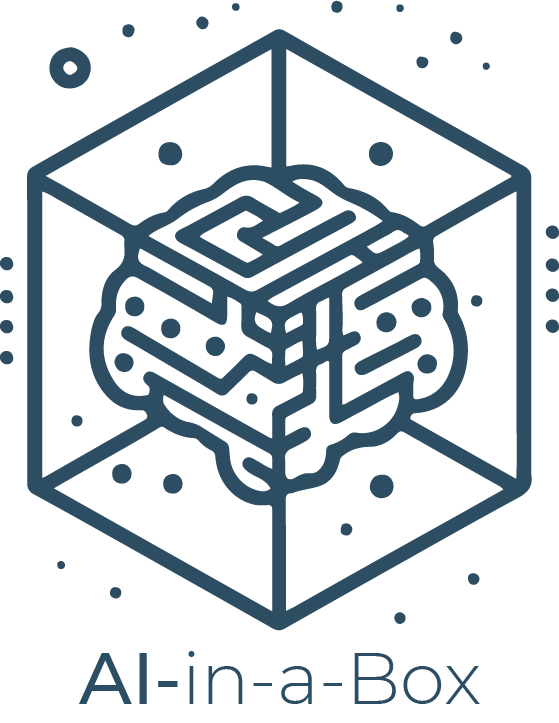

# AI-in-a-Box - Generative AI Bot Quickstart

|||
|:---| ---:|
|This solution is part of the the AI-in-a-Box framework developed by the team of Microsoft Customer Engineers and Architects to accelerate the deployment of AI and ML solutions. Our goal is to simplify the adoption of AI technologies by providing ready-to-use accelerators that ensure quality, efficiency, and rapid deployment.|  |

[](https://portal.azure.com/#create/Microsoft.Template/uri/https%3A%2F%2Fraw.githubusercontent.com%2FAzure-Samples%2Fgen-ai-bot-in-a-box%2Fmain%2Finfra%2Fazuredeploy.json)

## User Story

Virtual Assistants are one of the top use cases for Generative AI. With Bot Framework, you can deploy and manage an enterprise-scale chat application with multiple supported programming languages. You can also connect with different end-user channels like Web, Microsoft Teams or Slack, while maintaining a single bot implementation.

## What's in the Box


This sample provides a template and guidance on how to deploy a virtual assistant leveraging multiple Azure AI technologies. It covers the infrastructure deployment, configuration on the AI Studio and Azure Portal, and end-to-end testing examples.

The following implementations are supported:

| Language | Version | Chat Completions | Assistants API | Semantic Kernel | Phi-3 |
|----------|---------|------------------|----------------|-----------------|-------|
| Python   | 3.10    | ✔                | ✔              | ✔               | ✔     |
| C#       | 8.0     | ✔                | ✔              | ✗               | ✔     |
| NodeJS   | 21.0    | ✔                | ✔              | ✗               | ✔     |

> Notes: The Phi model implementation requires the deployment of an AI Project and Serverless Endpoint. It does not support function calling.
> Using Python with Bot Framework requires a Single Tenant Application.

## Thinking Outside of the Box

The solution can be adapted for your own use cases:

- Add custom AI plugins to perform integrations, such as:
    - Bing Search, to enable up-to-date information retrieval
    - MS Graph integrations to retrieve work profile information
    - Custom RAG using SQL queries
- Customize the authorization flow to use SSO
- Integrate with enterprise communication channels

## Deploy the Solution

[](https://portal.azure.com/#create/Microsoft.Template/uri/https%3A%2F%2Fraw.githubusercontent.com%2FAzure-Samples%2Fgen-ai-bot-in-a-box%2Fmain%2Finfra%2Fazuredeploy.json)

### Prerequisites for running locally:
1. Install latest version of [Azure CLI](https://docs.microsoft.com/en-us/cli/azure/install-azure-cli-windows?view=azure-cli-latest)
2. Install latest version of [Bicep](https://docs.microsoft.com/en-us/azure/azure-resource-manager/bicep/install)
3. Install latest version of [Azure Developer CLI](https://learn.microsoft.com/en-us/azure/developer/azure-developer-cli/install-azd)

### Deploy to Azure

1. Clone this repository locally
```
git clone https://github.com/Azure-Samples/gen-ai-bot-in-a-box
```
2. This repository provides the same application written in Dotnet, NodeJS and Python. Go to azure.yaml and uncomment the implementation you would like to use.


3. Deploy resources

```
cd gen-ai-bot-in-a-box
azd auth login
azd env new
azd up
```

You will be prompted for an environment name, a subscription, location and a few other customization parameters. Make sure to select the language you chose on the previous step, or deployment will fail.

## Run the Solution

### Additional Step if using Assistants API implementation

Set up an Azure OpenAI Assistant. You may use the scripts provided to deploy an initial Assistant and bind it to your application.

On Windows:
```pwsh
.\scripts\createAssistant.ps1
```

On Linux/Mac:
```sh
sh ./scripts/createAssistant.sh
```


Once the bot is deployed, you may send messages to it through the Web Chat, or by running locally.

### Test in Web Chat

Go to the resource group and find the Azure Bot Services instance.


Select the Test in Web Chat option.


Chat with your new bot!


> Note: The first time you open your bot after deployment, it may take a few seconds to respond. After interacting with it the first time, it will respond faster.

### Test in Bot Framework Emulator

You can also interact with your bot through the emulator by running the code locally.
How you run the code depends on the language chosen:

- Dotnet: 
```sh
    dotnet run
```
- Node: 
```sh
    npm install
    npm start
```
- Python: 
```sh
    pip install -r requirements.txt # Or set up a virtualenv / conda environment
    python app.py
```

## Customize the Solution

### Enabling SSO

You can enable Single-Sign-On for your bot so that it identifies the user and keeps a token in context, that can later be used to retreive personal information like their name/job title, as well as for Microsoft Graph API calls.

To enable SSO, use the provided scripts for Powershell and Bash. Please note that you should be an `Entra ID Application Developer` and a `Contributor` in the resource group in order to perform the following actions. You can also perform these steps in the portal if you prefer.

On Windows:
```pwsh
.\scripts\setupSso.ps1
```

On Linux/Mac:
```sh
sh ./scripts/setupSso.sh
```

### Enabling Web Chat

Web chat is disabled by default, as you may want to set up authentication before publishing your app. To enable it, use the provided scripts for Powershell and Bash.


On Windows:
```pwsh
.\scripts\setupWebchat.ps1
```

On Linux/Mac:
```sh
sh ./scripts/setupWebchat.sh
```

Please note that doing so will make your bot public, unless you implement authentication / SSO.

### Creating custom functions


## How to Contribute

This project welcomes contributions and suggestions. Most contributions require you to agree to a Contributor License Agreement (CLA) declaring that you have the right to, and actually do, grant us the rights to use your contribution. For details, visit <https://cla.opensource.microsoft.com>

When you submit a pull request, a CLA bot will automatically determine whether you need to provide a CLA and decorate the PR appropriately (e.g., status check, comment). Simply follow the instructions provided by the bot. You will only need to do this once across all repos using our CLA.

This project has adopted the [Microsoft Open Source Code of Conduct](https://opensource.microsoft.com/codeofconduct/). For more information see the [Code of Conduct FAQ](https://opensource.microsoft.com/codeofconduct/faq) or contact <opencode@microsoft.com> with any additional questions or comments.
## Key Contacts & Contributors

| Contact | GitHub ID | Email |
|---------|-----------|-------|
| Marco Cardoso | @MarcoABCardoso | macardoso@microsoft.com |

## License

This project may contain trademarks or logos for projects, products, or services. Authorized use of Microsoft trademarks or logos is subject to and must follow [Microsoft's Trademark & Brand Guidelines](https://www.microsoft.com/en-us/legal/intellectualproperty/trademarks/usage/general). Use of Microsoft trademarks or logos in modified versions of this project must not cause confusion or imply Microsoft sponsorship. Any use of third-party trademarks or logos are subject to those third-party's policies.


---

This project is part of the AI-in-a-Box series, aimed at providing the technical community with tools and accelerators to implement AI/ML solutions efficiently and effectively.
