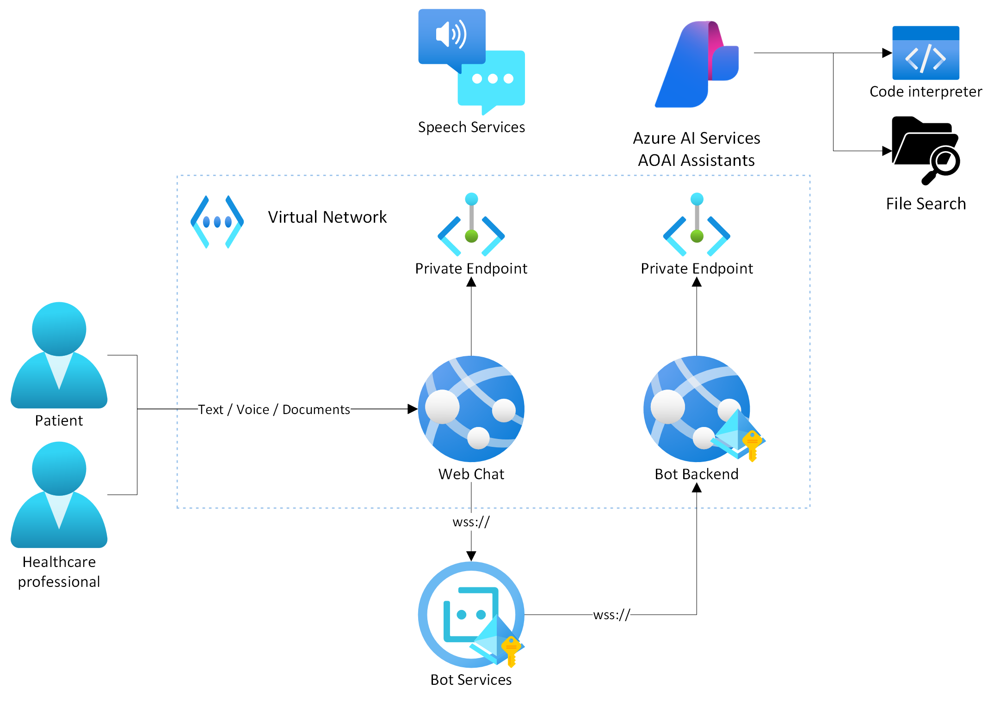
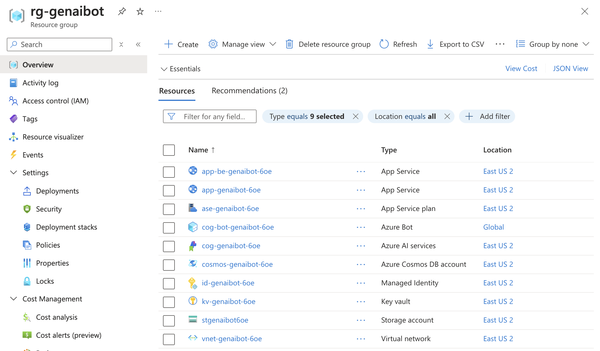
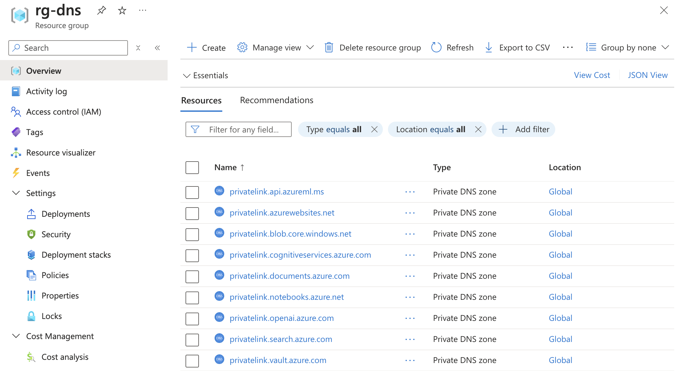
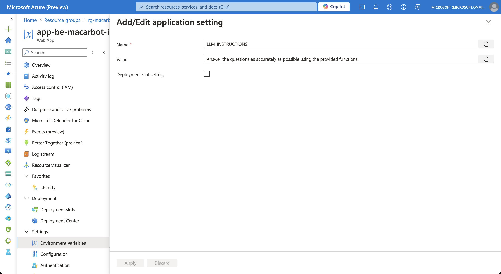
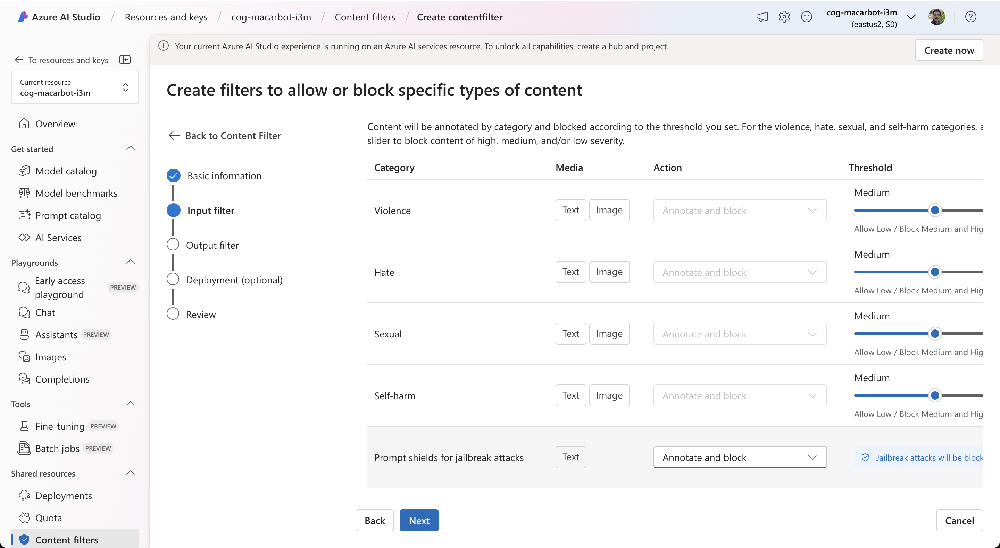
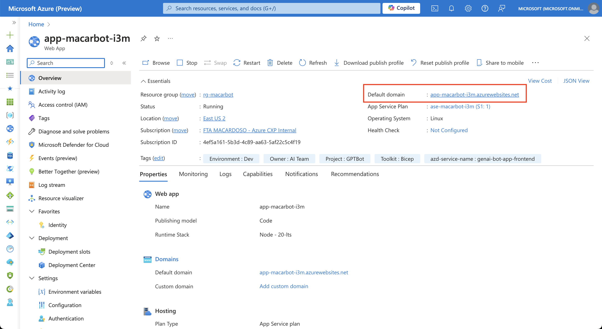
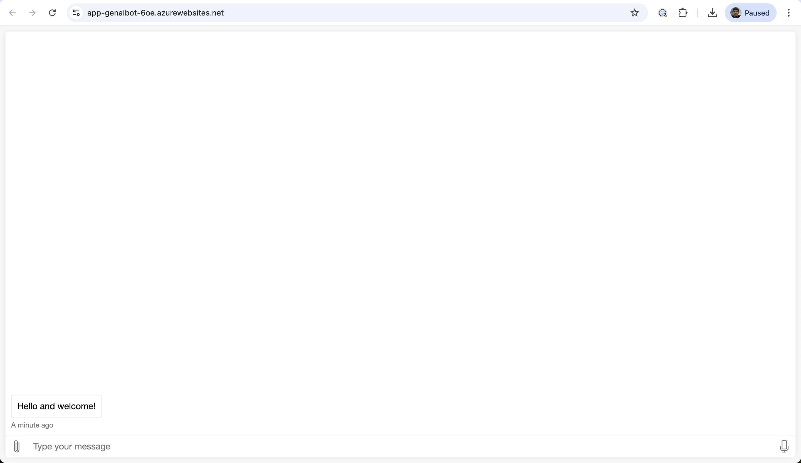
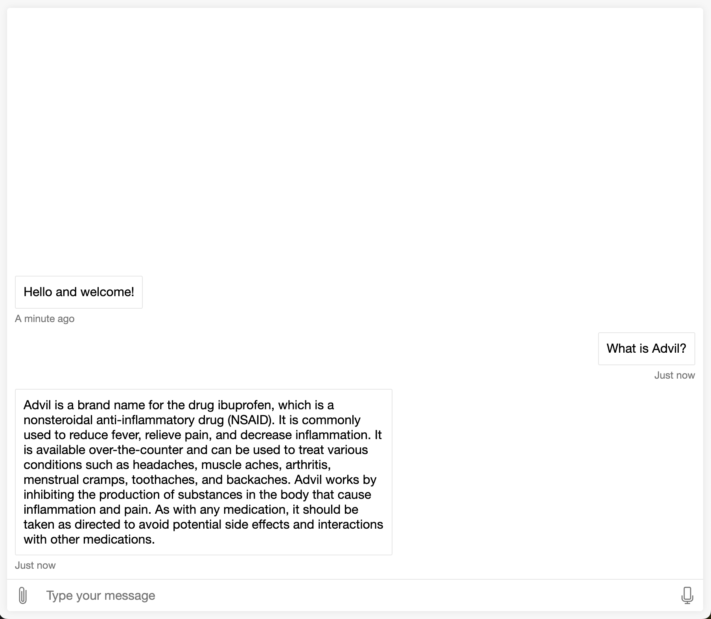
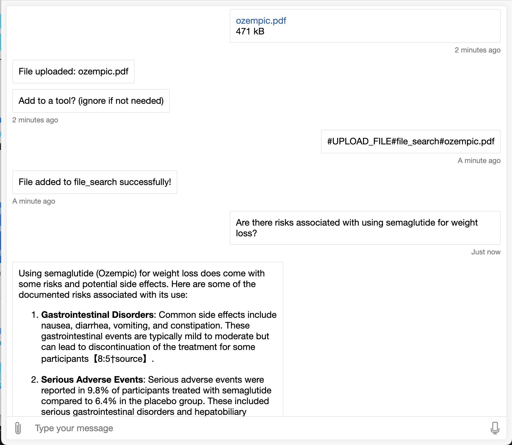
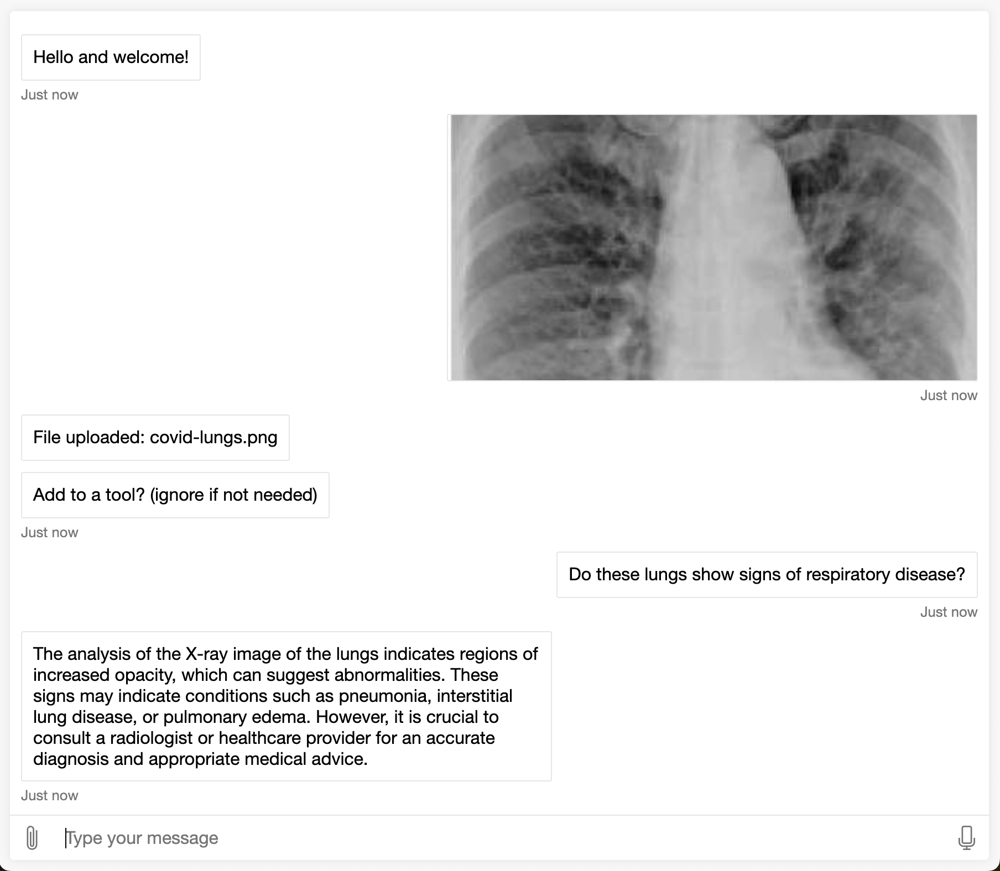

# Healthcare Quickstart - Live Translation and Assistance

## Use Case

Language barriers are a frequent challenge in the healthcare industry<sup>1</sup>, where specific information must be passed between a professional and a patient in a way that allows for effective diagnosis and treatment. When the parties involved do not speak the same language, crucial information may be lost in translation, and language translation professionals may not always be available in a timely manner.

Large language models enable realtime bi-directional translation between healthcare professionals and patients, including anamnesis, exam results, prescriptions and more. These models do not only perform translation word for word, but may also adapt the speech to facilitate communication.

## Solution Quickstart

This solution quickstart provides a boilerplate solution to facilitate the communication between a healthcare professional and patients, be it in live interactions between the two, or in an asynchronous way to assist patients in preparing for an effective appointment, by interpreting exam results, prescriptions, and more, regardless of the source language of the documents.

Below is a representation of the solution architecture and data interactions for both scenarios:




## Deployment Guide

### Infrastructure setup

To deploy this quickstart, start by deploying the Gen AI Bot in-a-Box template. Use one of the options below:

1. Deploy using local Azure Developer CLI

    ```sh
    azd up
    ```

2. Set up CI/CD (Recommended)

    > azd pipeline config --provider [azdo | github] --principal-name your_app_registration_name

When prompted, use the following configurations:

| Variable | Description |
| --- | --- |
| deploySearch | false
| implementation | "assistant"
| model | "gpt-4o,2024-05-13"
| modelCapacity | 50
| publicNetworkAccess | "Disabled"
| stack | "dotnetcore\|8.0"
| systemDatastoresAuthMode | "identity"

The following resources will be deployed:

Workload resource group:



DNS resource group:



Both applications will be automatically configured with the required environment variables. Refer to the Operational Guide for information on these variables.

### Quickstart configuration

Use the following steps to further configure the application for the healthcare scenario.

1. **System prompt**: Provide the necessary instructions to shape the behavior of the assistant depending on the use case. System messages can be provided in the App Service's (backend) Environment Variables, as shown below:

    

    Use the examples below and make adjustments as needed.

    Live translation:

    > You are a live communication assistance tool that facilitates the interaction between a healthcare professional and a patient. Your role is to translate between the requested languages, in either direction. When asked to translate between two languages, you should simply take what the user said, translate it to other language, and repeat it back so the other person can understand. Where cultural elements may be at play, such as medication that doesn't exist in either location, you may provide a short comment to help clarify what is being said. Always output content in the following SSML format: <speak version="1.0" xmlns="http://www.w3.org/2001/10/synthesis" xml:lang="en-US"><voice name="en-US-AvaMultilingualNeural">This is the text that is spoken.</voice></speak>. Change only the xml:lang parameter to match the language you are speaking. Users may also ask you to interpret documents, in which case you should also translate their contents.

    Virtual Assistance:

    > You are a helpful healthcare self-service virtual assistant. Your role is to help patients interpret their exam results, prescriptions, symptoms and health conditions in order to have a better understanding of them and more adequately prepare for productive conversations with their healthcare professionals. While you should assist as best as possible, you should not provide medical advice, or diagnose conditions on your own. Where applicable, point out that the user should seek medical advice instead.

2. Content Filtering

Configure content filters to properly safeguard the application from unintended use. 

- Navigate to the [Content Filter section of AI Studio](https://ai.azure.com/resource/contentfilters/contentFilter)
- Adjust each filter category accordingly.

> Note: when content filtering is triggered, the bot will refuse to respond. Use this to limit the bot's responses on some categories.
- Apply changes to the desired model deployments.

Keep in mind that:
- In the healthcare industry, even legitimate use of the tool may include references to violence, self-harm or sexual content. Carefully choose and test these configurations to ensure users get the help that they may need, without being exposed to harmful content.
- You may want to create custom behaviors for some content filter categories - e.g. provide emergency hotline numbers. For others, it may be enough to refuse to answer.

## User Guide

### Using the webchat

After deployment, you may reach the webchat by accessing the front-end application's default domain:






You may interact with the assistant by typing into the chat, or by clicking the microphone icon and speaking. Start by specifying the role of the assistant in the conversation.

When using audio input, select the language before speaking. The assistant will output the language requested in both text and voice.

### Key functionalities

- **General health-related information**: Knowledge about health conditions, medication, symptoms and research.



- **Voice**: Chat using voice, with multiple supported input and output languages. Translate between different languages


- **Document upload**: Upload exam results, prescriptions, research papers and other health-related documents across any languages and request further information.



- **Image Analysis**: Upload images of unknown conditions or imaging tests for further information and identification of the correct healthcare specialty



**Out of scope**

- Direct medical advice and diagnosis. This tool does not replace medical assistance.
- Simultaneous translation. The application will wait for a pause in speech before answering.

## Troubleshooting

Please refer to the [Main README](../../README.md) for troubleshooting steps.

## References

1. [Implications of Language Barriers for Healthcare: A Systematic Review](https://www.ncbi.nlm.nih.gov/pmc/articles/PMC7201401/)