# Retail Quickstart - Intelligent Product Recommendation

## Use Case

In the Retail & Consumer Goods Industry, highly relevant product discovery by its consumers is critical for any retailer (direct or indirect). This is the first step to drive sales (their top line), as product discovery converts into a sale through multiple channels, offers, promotions etc.

Every major retail store has an online presence in the e-retail space, through their own portals or through other e-retail collaborations, where their consumers can search for products, browse through catalogs, etc.  


## Solution Quickstart

This solution quickstart provides a boilerplate solution to accelerate the development and deployment of intelligent applications designed to assist in product discovery through virtual assistants.

Below is a representation of the solution architecture:

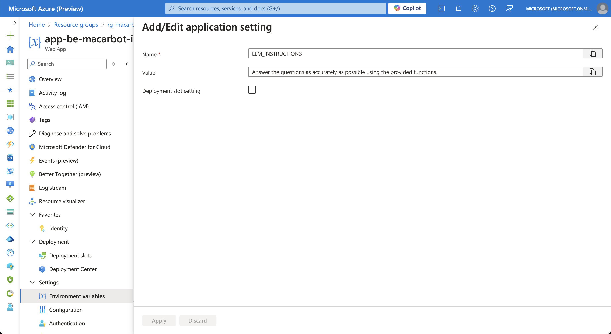

## Deployment Guide

### Infrastructure setup

To deploy this quickstart, start by deploying the Gen AI Bot in-a-Box template. Use one of the options below:

1. Deploy using local Azure Developer CLI

    ```sh
    azd up
    ```

2. Set up CI/CD (Recommended)

    > azd pipeline config --provider [azdo | github] --principal-name your_app_registration_name

When prompted, use the following configurations:

| Variable | Description |
| --- | --- |
| deploySearch | true
| implementation | "chat-completions"
| model | "gpt-4o,2024-05-13"
| modelCapacity | 50
| publicNetworkAccess | "Disabled"
| stack | "dotnetcore\|8.0"
| systemDatastoresAuthMode | "identity"

The following resources will be deployed:

Workload resource group:

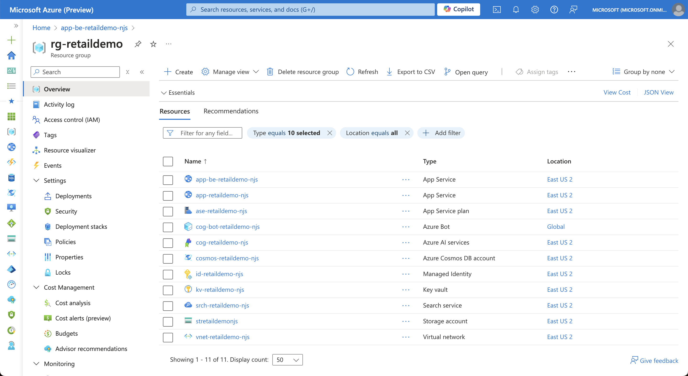

DNS resource group:

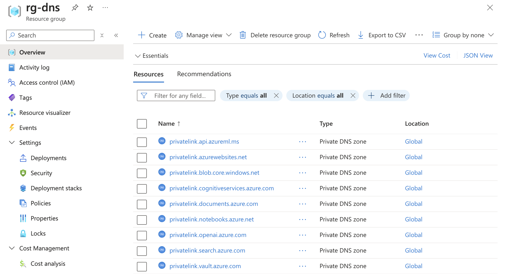

### Quickstart configuration

Use the following steps to further configure the application for the e-retail scenario.

1. **System prompt**: Provide the necessary instructions to shape the behavior of the assistant depending on the use case. System messages can be provided in the App Service's (backend) Environment Variables, as shown below:

    

    Use the examples below and make adjustments as needed.

    > You are a helpful e-retail self-service virtual assistant. Your role is to help customers find the most relevant products based on their interactions. You have access to the product catalog and may issue searches to it as you interact with potential customers in order to recommend and provide details about available products. When referring to a product, always provide the link back to the online store, listed price, and display an image of the product when available. You are encouraged to ask follow-up questions to narrow down the options before making a product search. Whenever the user refers to an image, you should limit yourself to analyzing and confirming the contents of it, and not respond right away. For example: \nUser: <Uploads an image> Can you help me find items like these? \nAssistant: Sure! I can see the following items: ... Would you like me to search our catalog for them? \nUser: Yes, please! \nAssistant: <Searches catalog> Here are some options I found...\n ### Never provide product recommendations outside of the provided catalog.

2. Data import

Follow the steps below to import the [Sample Product Catalog](./data/catalog.csv) to Azure AI Search:

- Download the [Azure Cosmos DB Desktop Data Migration Tool](https://github.com/AzureCosmosDB/data-migration-desktop-tool/releases) for your operating system;

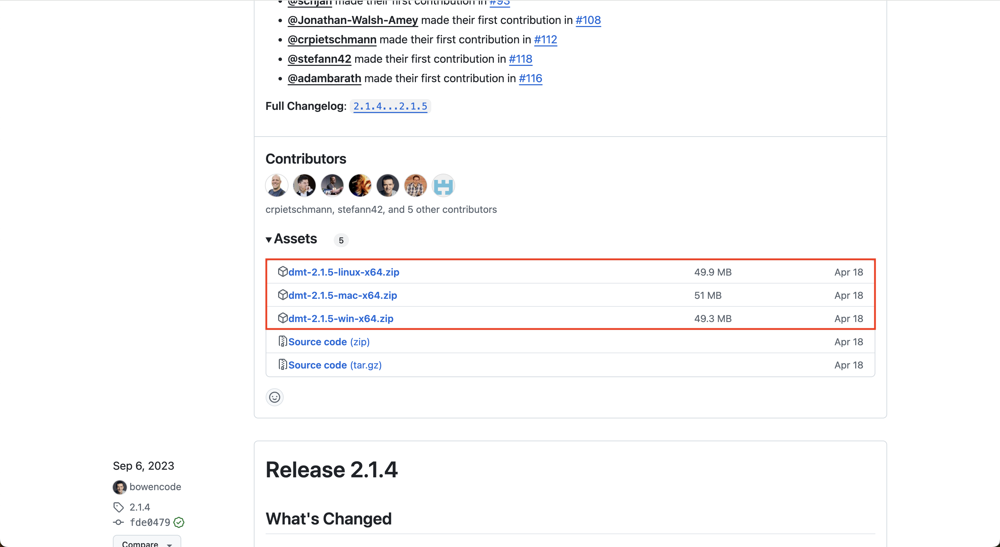

- Update the `migrationsettings.json` file using the sample provided [here](./data/migrationsettings.json). Make sure to provide the path to the CSV file and your Cosmos DB connection string. The CSV file is provided in this quickstart.

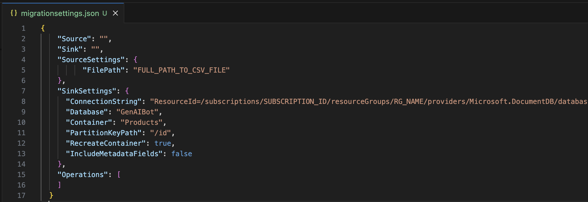

- Temporarily enable local authentication on the Cosmos DB account (this may take a few minutes to take effect):
```sh
az resource update --ids /subscriptions/SUBSCRIPTION_ID/resourceGroups/rg-eretail/providers/Microsoft.DocumentDB/databaseAccounts/COSMOS_DB_ACCOUNT_NAME --set properties.disableLocalAuth=false --latest-include-preview
```

- Run the Data Migration Tool:
```sh
    ./dmt
```
- When prompted, select CSV as the source and Cosmos DB noSQL as the sink.
- A successful output will look like this:

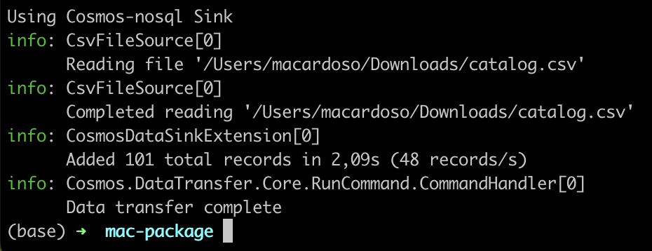

- Review the created collection

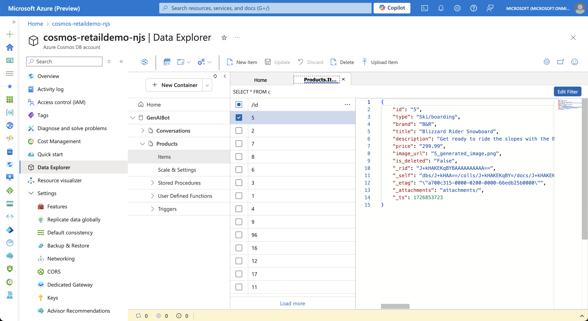

- Disable local authentication on the Cosmos DB account:
```sh
az resource update --ids /subscriptions/SUBSCRIPTION_ID/resourceGroups/rg-eretail/providers/Microsoft.DocumentDB/databaseAccounts/COSMOS_DB_ACCOUNT_NAME --set properties.disableLocalAuth=true --latest-include-preview
```

3. Configure AI Search

Next, import the Cosmos DB data into an AI Search index:

- Go to your AI Search resource, navigate to `Data sources` and add a new data source;

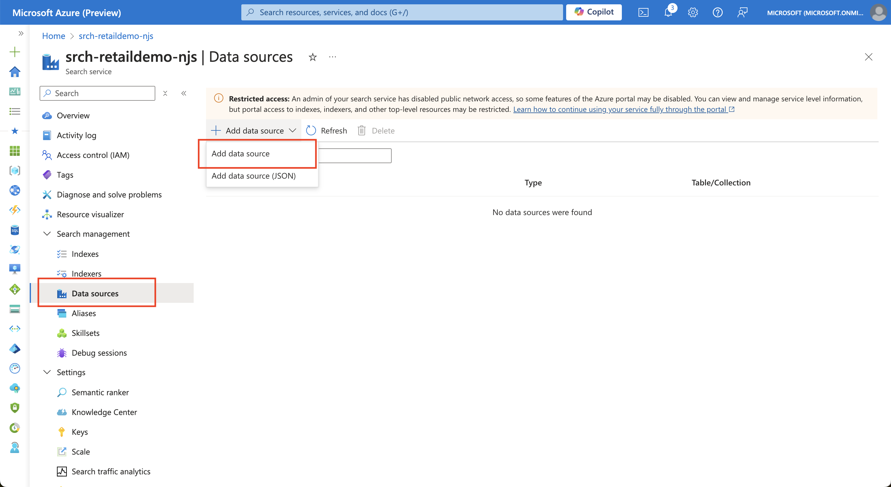

- Select Azure Cosmos DB as a Data source and fill out the required fields as below:

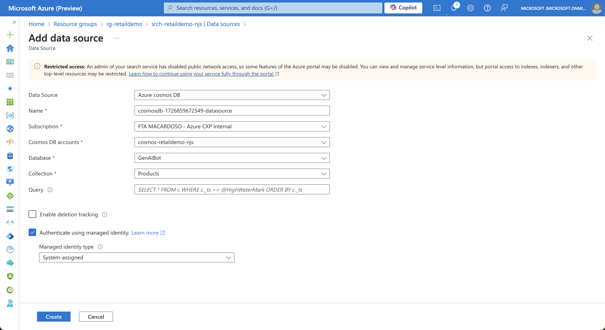

- Return to the overview and select `Import data`

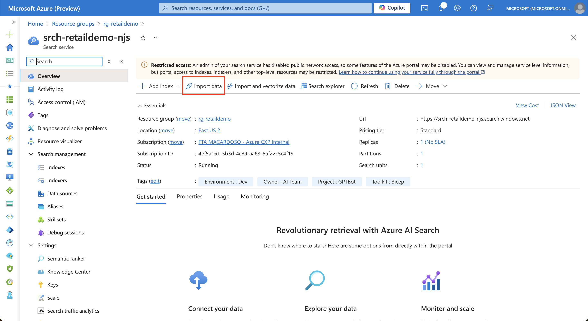

- Select the data source you just created

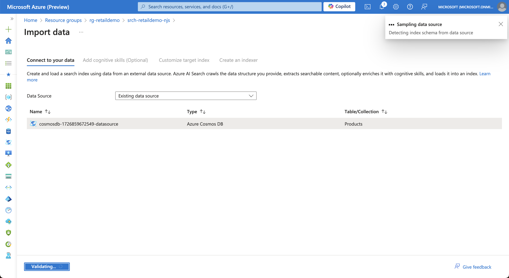

- Skip Cognitive Skills setup;
- Select the appropriate fields as retrievable and searchable as shown below.

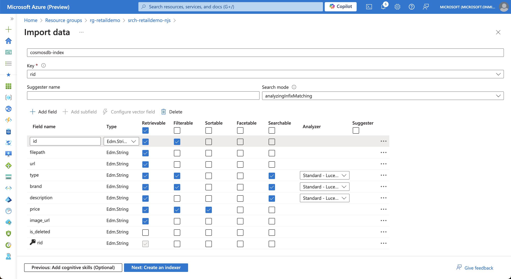

- Leave other configurations as default and create the index
- Review and test the newly created index.

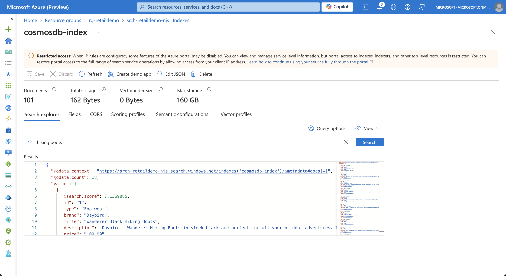

- Update the search index environmnent variable on the backend App Service instance

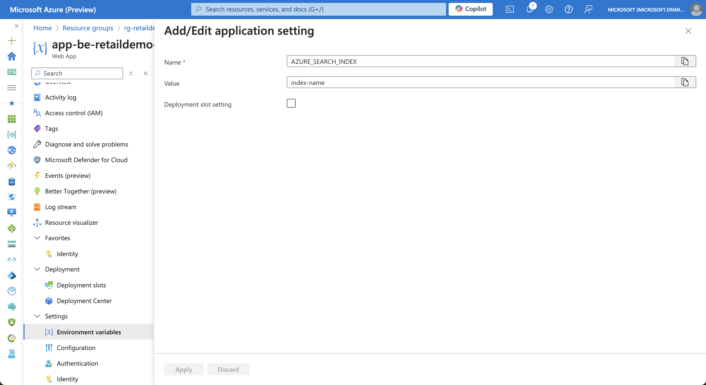

4. Content Filtering

Configure content filters to properly safeguard the application from unintended use. 

- Navigate to the [Content Filter section of AI Studio](https://ai.azure.com/resource/contentfilters/contentFilter)
- Adjust each filter category accordingly.
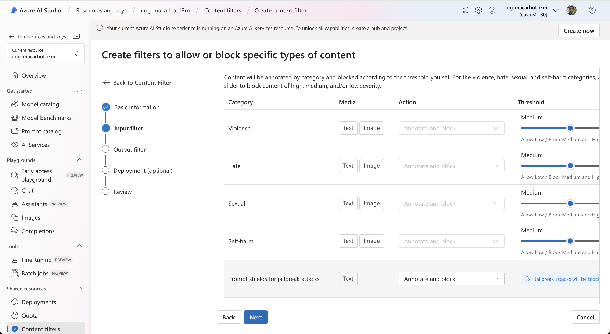
> Note: when content filtering is triggered, the bot will refuse to respond. Use this to limit the bot's responses on some categories.

## User Guide

### Using the webchat

After deployment, you may reach the webchat by accessing the front-end application's default domain:

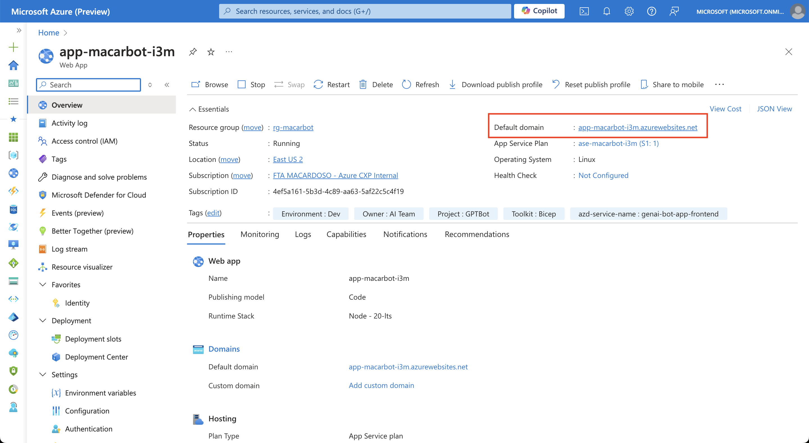

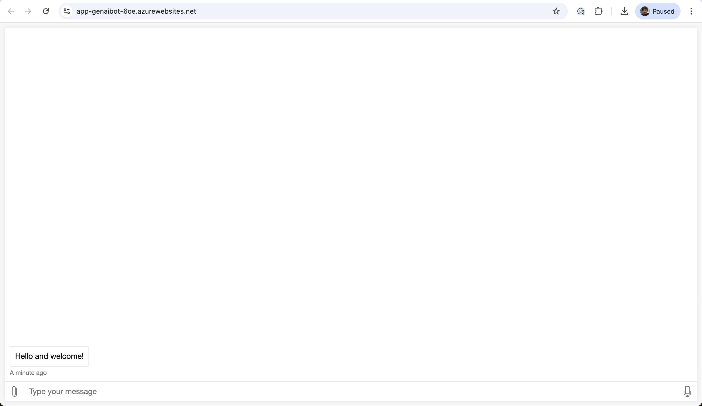

You may interact with the assistant by typing into the chat, or by clicking the microphone icon and speaking.

### Key functionalities

- **Text-based search**: Search for products in the catalog by interacting with the bot

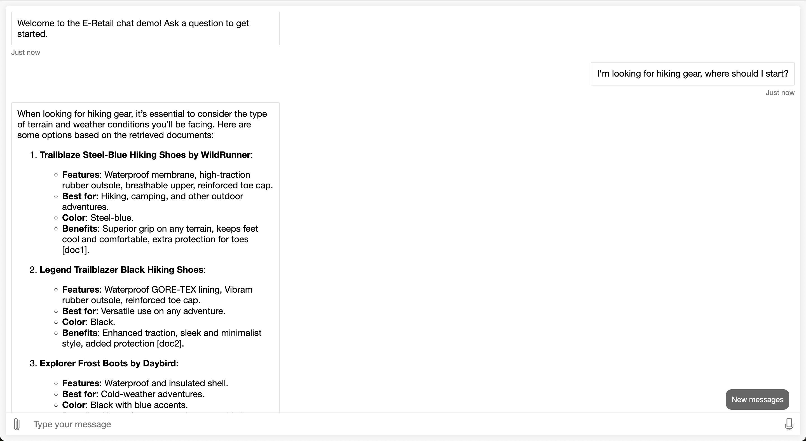

- **Image-based search**: Provide images of items similar or that provide further insight into products you are looking for.

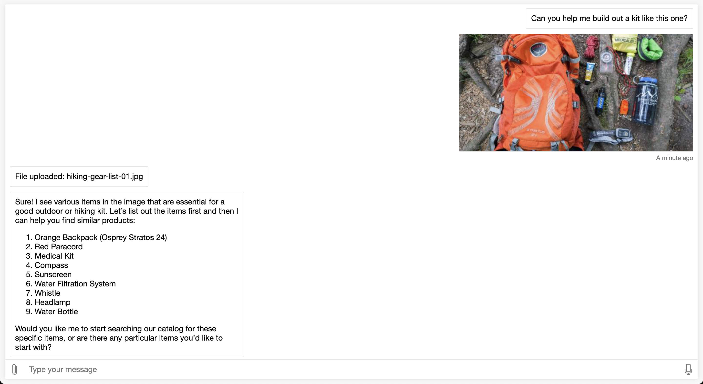
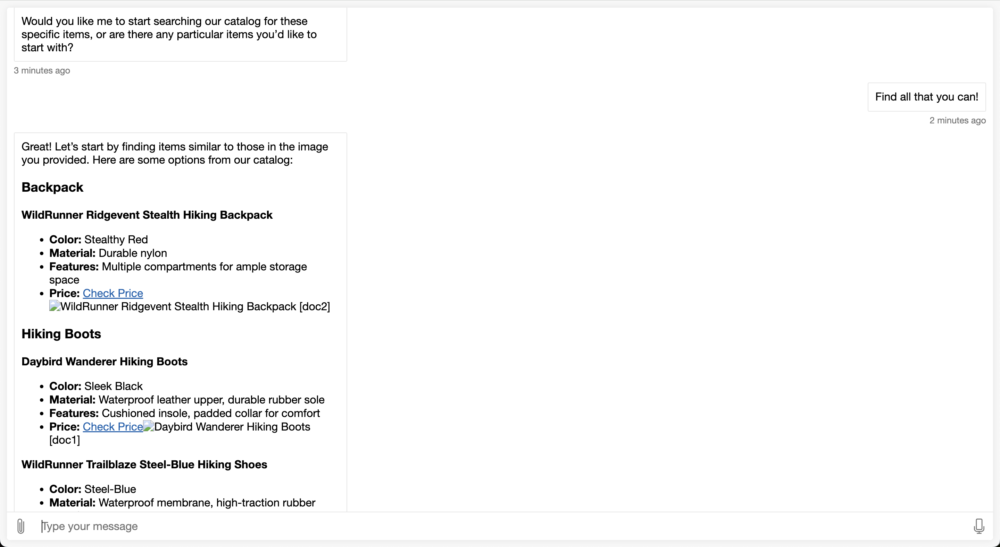

## Troubleshooting

Please refer to the [Main README](../../README.md) for troubleshooting steps.

## References
